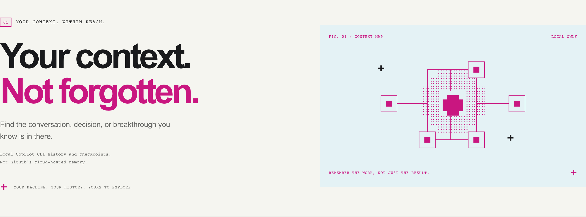

# Copilot Memory Dashboard



A local, read-only web app for exploring **GitHub Copilot CLI session history**.
Search prompts, responses, session summaries, and checkpoints. Filter by repository,
source, and date, then inspect the original conversation, saved checkpoints, files,
and references in independently closable document tabs.

The interface uses a compact paper-and-ink editorial layout, magenta accents,
and monospace annotations, with a moon/sun toggle for the matching dark theme.
The artwork above lives in this README, not in the working app. Explorer is the home page; Dashboard
is a separate top-level route. No sidebar, external fonts, telemetry, or remote services.

## What "memory" means here

Copilot CLI keeps a local history database, usually at
`~/.copilot/session-store.db`. This app reads that database's `sessions`, `turns`,
and `checkpoints` tables. File and reference metadata are shown when available.

This is **not** a viewer for GitHub's cloud-hosted Copilot Memory facts or user
preferences. It does not authenticate to GitHub, synchronize cloud history, or
read an extension's `copilot-local-memory.sqlite`. It also does not read raw
session logs, instruction files, or local dynamic-context tables. Dashboard
optionally reads `assistant_usage_events` from the same database. Only data
already persisted in the CLI database is available.

The CLI schema is internal and can change. Unsupported databases produce a
visible setup error instead of being modified or treated as empty.

## Run locally

Requires **Node.js 24+**. Install the locked Markdown-rendering dependencies once:

```sh
npm ci --omit=dev
npm start
```

Open **http://localhost:3210**. The database path defaults to the current user's
home directory; no username or machine-specific path is stored in this project.

To use a different path or port:

```sh
COPILOT_DB_PATH=/path/to/session-store.db PORT=3211 npm start
```

PowerShell:

```powershell
$env:COPILOT_DB_PATH = "$HOME\.copilot\session-store.db"
$env:PORT = "3211"
npm start
```

Run at least one Copilot CLI session if the database does not exist yet.
Node may print an experimental `node:sqlite` warning.

### Try it without personal history

```sh
npm run demo
```

The demo uses entirely synthetic example conversations in a temporary OS
directory. It never opens your Copilot database. The temporary directory is
removed on normal shutdown.

## Docker

Requires Docker with Compose. No GitHub token is needed.

```sh
docker compose up --build -d
```

Open **http://localhost:3210**. Compose mounts the current user's `.copilot`
directory **read-only**, and publishes the port only on `127.0.0.1`.
The image contains only app code and assets, not your database.

For a custom database directory, copy `.env.example` to `.env` and set
`COPILOT_DATA_DIR` to the directory containing `session-store.db`. `PORT` changes
the host port, not the container's internal port. Prefer an absolute path if your
Compose installation does not expand `~`.

PowerShell:

```powershell
$env:COPILOT_DATA_DIR = "$HOME\.copilot"
docker compose up --build -d
```

Mount the **directory**, not just the `.db` file. An active SQLite database may
need `session-store.db-wal` and `session-store.db-shm` to read the latest committed
history. Do not use SQLite's `immutable=1` option on a live WAL database.

On Linux, the container's non-root user must be able to read the mounted files.
For private directories, run with your host UID and GID rather than making your
history world-readable:

```sh
docker compose run --rm --service-ports --user "$(id -u):$(id -g)" dashboard
```

Docker Desktop may require permission to share the database's parent directory.
If SQLite cannot read a read-only mount because WAL/SHM sidecars are missing,
use `npm start` or create a consistent SQLite backup outside this repository,
mount its directory, and treat it as a snapshot. Do not copy only a live `.db`
file: that can omit committed WAL records.

Stop the container:

```sh
docker compose down
```

## Search behavior

- Search is case-insensitive for ASCII text. Every whitespace-separated word must
  occur in the same entry. Punctuation is literal, not SQL or FTS syntax.
- A prompt, response, session summary, or checkpoint is one search entry.
  Explorer groups matching entries into one card per session, showing the newest
  match as a Markdown preview and the number of matches in that session. Counts
  distinguish unique sessions from matching entries. Inspect the session for
  the full conversation and checkpoints.
- Dates are inclusive calendar-date filters on each entry's stored timestamp.
- Results are newest-first, with 20 sessions per page. Each session document shows
  ten turns at a time and jumps to the page containing the selected turn.
- Queries re-read the source database; nothing is imported or cached. Submit
  another search to see new history, or reload to refresh statistics.
- Press `/` to return to Explorer and focus search. Session tabs preserve their
  conversation page, expanded checkpoints, and scroll position during this visit.
  Use the tab's close button to close it. Arrow keys, Home, and End navigate the
  document tab strip. Session links can be opened directly, but open tabs are not
  saved to browser storage.
- Search previews, session prompts, responses, and checkpoints render Markdown headings, lists,
  tables, inline code, and syntax-highlighted fenced code blocks. Backtick, tilde,
  and triple-apostrophe fences are supported. Code blocks keep a dark background
  in both themes and have copy buttons in the full session view. Search previews
  remain bounded excerpts; open the session for full context or complete code.
- Theme preference is saved locally; no conversation content is saved in
  browser storage.

Search uses parameterized SQLite queries over the source tables, not a new index.
The search API keeps entry-level results by default; `group=session` requests
the same grouped results as Explorer without removing any source records.
Very large histories can therefore be slower. SQLite's built-in case folding does
not provide full Unicode case-insensitive matching.

## Recorded usage dashboard

Open **http://localhost:3210/dashboard** or use Dashboard in the top menu. Filter
by repository and inclusive event dates, or refresh to see new records. Click a
table header to sort; click again to reverse. Sorting uses underlying numbers,
not formatted strings, with unavailable values last and ties kept stable.

Available metrics include input/output tokens, cache read/write tokens, reasoning
tokens, recorded AI usage units (AIU), model and repository breakdowns, daily
activity and token charts, response duration, first-token and inter-token latency,
request multipliers, session activity spans, finish reasons, reasoning effort,
initiators, API endpoints, recorded billing-model names, agent counts, and
content-filter status. Availability depends on the CLI version and recorded fields.

**Estimated usage value** applies a bundled snapshot of
[GitHub's published Copilot per-token rates](https://docs.github.com/en/copilot/reference/copilot-billing/models-and-pricing),
verified **2026-10-01**, to each supported local event. The dashboard shows estimated
USD, estimated GitHub AI credits, model/repository cost breakdowns, and daily
estimated-cost trends. One GitHub AI credit equals $0.01 USD.

**Actual dollar spending remains unavailable.** Estimates are gross usage value,
not an invoice: they exclude plan subscription fees, included allowances, taxes,
auto-selection discounts, and legacy premium-request billing. Historical events
are repriced at the snapshot rates, not their original rates. Unknown or retired
models without a current published rate are excluded rather than assigned a
similar model's price. Coverage and exclusion reasons appear with the estimate.

Recorded `token_details_json` category counts take precedence when available.
Otherwise, the estimate assumes normalized `input_tokens` includes cache reads
and writes, subtracts them, and prices each category exactly once. Missing or
invalid required categories are excluded. Long-context tier thresholds are
checked per event, not against summed tokens. Reasoning tokens are not charged
again on top of output. Gemini promotional rates expire on 2026-12-31; after that,
those models remain unpriced until the snapshot is updated.

`total_nano_aiu / 1,000,000,000` remains a separate recorded AIU metric. It is not
treated as dollar spending or GitHub AI credits. Pricing is bundled in
`lib/pricing.js`; the app does not contact GitHub at runtime. The source link and
snapshot date remain visible so rate changes can be reviewed before updating.

Null or missing fields remain **Not recorded**, with sample counts to show partial
coverage. Negative token or duration samples are excluded. Cache and reasoning
tokens are reported separately because they may overlap input/output categories.
Session activity span is the elapsed time from first to last usage event within
the chosen filters, including idle time, not active coding time. Sessions with
only one timestamp are excluded from that average.

Charts appear before the model/repository tables, with estimated cost first.
They include labeled Y axes (USD for pricing) and seven-day moving-average
trend lines. Averages use available values, with shorter windows at the start;
unavailable days break the line and zero-event days count as zero. Exact daily
values remain available in sortable tables beneath each chart.

Daily session activity uses the session creation date; usage metrics use event
timestamps. Charts show the latest 30 calendar days containing the last dated
activity in the selected range, including zero-event days. Totals cover the full
selected range. Undated records can contribute to totals but not charts.
Missing usage tables do not prevent Explorer or session activity from working.

## Local context API

Local model applications and tool runners can use the existing read-only JSON
API without a GitHub token:

```sh
curl --get http://localhost:3210/api/search \
  --data-urlencode "q=cache invalidation" \
  --data-urlencode "repository=example/widget-api" \
  --data-urlencode "limit=5"

curl --get http://localhost:3210/api/session \
  --data-urlencode "id=SESSION_ID_FROM_SEARCH" \
  --data-urlencode "turn=TURN_INDEX_FROM_SEARCH"
```

Search returns `results`, `total`, `offset`, and `limit`. Each result includes
`session_id`, `turn_index`, source `kind`, repository, timestamp, a bounded plain
`excerpt`, and sanitized `excerpt_html`. Session responses include raw
`user_message` and `assistant_response` fields, checkpoints, file/reference
metadata, and pagination (`offset`, `limit`, `totalTurns`). Use the raw Markdown
fields as model context, not the HTML presentation fields.

Have the local model's host-side tool runner retrieve a few repository-filtered
matches, fetch only relevant session pages, and enforce its own context/token
budget. Treat retrieved history as untrusted data, not instructions. No MCP
adapter, automatic model connection, or bulk context-export endpoint is included.
Browser cross-origin access remains blocked; integrations should call from their
local backend rather than weakening CORS or exposing the port to the network.

## Privacy and limits

**History can contain secrets and personal details.** They are visible in your
local dashboard; the app does not redact them. Avoid screen sharing it, exposing
it through a tunnel, or running it on a shared server.

The app opens SQLite read-only, exposes no write/delete endpoints, sends no
telemetry, calls no AI services, and uses no GitHub credentials. Responses are
marked `no-store`, cross-origin reads and non-loopback Host headers are rejected,
and conversation Markdown is rendered server-side with raw HTML disabled and
sanitized before display. Images are replaced with placeholders, so remote
trackers never load. Links only open after an explicit click; code copy uses the
local clipboard. The default server
binds to loopback. `HOST=0.0.0.0` exists for Docker; keep the published port bound
to loopback. There is no authentication, so other users/processes on the same
machine may still reach the local port.

Database files, logs, `.env` files, and browser artifacts are git-ignored. Docker
uses an allowlist so none of these enter its build context. Do not put your
database, screenshots of real sessions, or personal configuration into commits.

This is an independent project, not an official GitHub product.

## Development

```sh
npm ci
npm run check
npm test
npx playwright install chromium
npm run test:browser
```

All automated tests use synthetic temporary databases. Browser tests cover
desktop and mobile layouts, search, pagination, filters, independent session tabs,
theme persistence, usage totals and missing-data behavior, exact current-rate
calculations, pricing coverage and thresholds, numeric table sorting, safe
Markdown, literal untrusted text, and absence of external requests.
